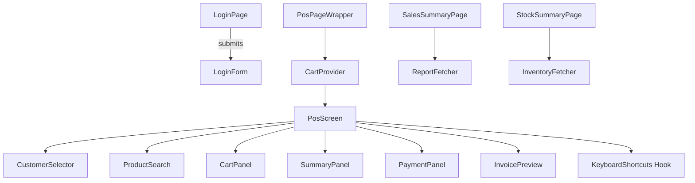

# Professional POS Billing UI Architecture

This document outlines the design, component structure, implementation details, and UX considerations for the fast, cashier-friendly POS billing interface built with Next.js (App Router), React, TypeScript, and Tailwind CSS.

---

## 1. System Overview

The frontend is split into two main areas:

1. **Public client (shop floor)** – login screen and main POS billing screen used by cashiers.
2. **Admin section** – sales summaries and stock quick view.

Routing (App Router) follows:

- `/login` – authentication page.
- `/pos` – main billing interface (requires JWT token).
- `/admin/sales-summary` – daily sales report.
- `/admin/stock-summary` – inventory snapshot.

Global UI state is managed through a `CartContext` provider that holds invoice items, customer info, discounts, and payments.

All API calls are performed via `lib/api.ts`, a thin wrapper attaching JWT and handling errors.

---

## 2. Folder Structure

```
/app
  layout.tsx            # global wrappers (e.g. auth check)
  login/
    page.tsx            # login screen
  pos/
    page.tsx            # main billing screen
  admin/
    sales-summary/page.tsx
    stock-summary/page.tsx
/components
  LoginForm.tsx
  ProductSearch.tsx
  CartPanel.tsx
  SummaryPanel.tsx
  PaymentPanel.tsx
  CustomerSelector.tsx
  InvoicePreview.tsx
/hooks
  useKeyboardShortcuts.ts
/context
  CartContext.tsx
/lib
  api.ts
```

> 💡 Additional directories may be added as features expand (e.g., `modals/`, `utils/`, `hooks/`).

---

## 3. Component Tree Diagram



This hierarchy illustrates how the POS screen composes smaller, reusable UI blocks and hooks.

---

## 4. Screen Wireframes (text-based)

### 4.1 Login Screen
```
+-------------------------------+
|          FURNISH POS          |
|-------------------------------|
|  Email: [______________]      |
|  Password: [___________]      |
|                               |
|  [ Sign In ]                  |
+-------------------------------+
```

### 4.2 POS Billing Screen
```
+---------------------------------------------------------------+
| [Customer selector]                                            |
|                                                               |
| [Search product...]                                           |
+---------------------------------------------------------------+
|                                                               |
|   Cart (items list)            |   Summary & Payment Box       |
|   -------------------           |   -------------------------   |
|   | product | qty |  |          |   Subtotal: ₹xxx            |
|   |--------|-----|  |          |   Tax: ₹yy                 |
|   | ...               |        |   Discount: -₹zz          |
|   |                  |          |   Total: ₹total            |
|   -------------------           |   Paid: ₹pp               |
|                                   |   Balance: ₹bb           |
|                                   | [add payment]            |
|                                   | [finalize + print]       |
+---------------------------------------------------------------+
```

### 4.3 Product Search Panel (modal/dropdown)
```
+------------------------------------+
| Search: [_______________]          |
|------------------------------------|
| result 1 – ₹price                  |
| result 2 – ₹price                  |
| ...                                |
+------------------------------------+
```

### 4.4 Customer Selector
```
[search input] [+] -> creates new customer
selected: Anvesh(9999999999)
```

### 4.5 Invoice Preview (modal)
```
Invoice #123      Date
Customer: Anvesh
---------------------------------
Item    Qty   Total
JaggedLine ...
---------------------------------
Subtotal ₹
Tax ₹
Discount -₹
Total ₹
---------------------------------
Payments:
 CASH ₹
=================================
```

### 4.6 Admin Pages
Similar to simple data tables or charts retrieved from `/api/reports` or `/api/inventory`.

---

## 5. Keyboard & UX Optimizations

- **Search focus**: `F` key jumps to product search box.
- **Add first result**: `Enter` in search adds top result.
- **Shortcut payments**: `F1`–`F5` map to cash, card, UPI, bank, advance.
- **Qty adjustments**: arrow keys or direct numeric input with selected row.
- **Clear invoice**: `Esc` key resets cart (confirm). 
- **Tab order** respects logical flow: search → cart → summary → payment → finalize.
- Touch-friendly controls: large buttons, full-width inputs, responsive layout for tablets.

Accessibility notes:
- All interactive elements have `aria-label`s and high contrast.
- Focus outlines remain visible for keyboard-only users.

---

## 6. API Integration Strategy

The frontend relies on the backend APIs already implemented during the previous phase:

| Purpose | Endpoint | Notes |
|---------|----------|-------|
| Authenticate | `POST /api/auth/login` | returns JWT
| Search products | `GET /api/products/search?query=` | debounced
| Add invoice item | (no call until finalize) | local state
| Finalize invoice | `POST /api/invoices/finalize` | payload: items, customerId, payments, discount
| Search customers | `GET /api/customers/search?query=` | used in selector
| Create customer | `POST /api/customers` |
| Daily sales | `GET /api/reports/daily-sales` |
| Inventory list | `GET /api/inventory` |

Requests go through `lib/api.ts` which adds the Authorization header automatically.

All failures bubble up and show alerts; UX could later be improved with toast notifications.

---

## 7. Implementation Notes

- The `CartContext` encapsulates invoice state; it can be replaced with state management libraries if needed.
- Components are "universal" and can be reused on tablet/desktop.
- The `pos/page.tsx` file composes the pieces and handles finalization logic.
- Additional features (discount coupons, multiple stores, offline support) can plug into this architecture.

---

## 8. Next Steps & Extensions

1. **Build product quick grid**: show popular/featured items below search for touch selection.
2. **Persist unfinished invoices**: save to localStorage or backend draft API.
3. **Print layout**: implement `InvoicePreview` to render nicely and trigger PDF/ESC-POS printing.
4. **User roles**: integrate RBAC to restrict admin pages.
5. **End-to-end tests**: use Cypress/Playwright to verify keyboard flows.

This foundation delivers a production-ready POS interface that emphasizes speed, clarity, and maintainability for real shop staff.
